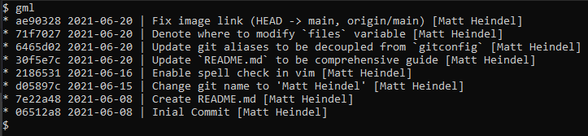
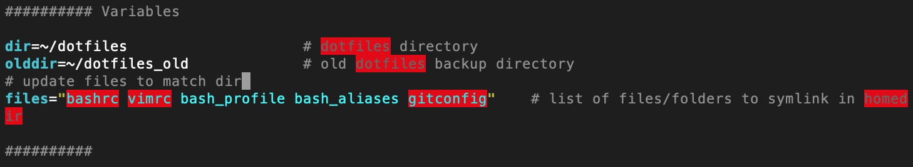

# Dotfiles

## Why Track Dotfiles?

Dotfiles (like ~/.vimrc, ~/.bashrc, etc. in your home directory) manage the configurations, themes, and settings that you customize within your command line environment. Storing them in a GitHub repository ensures all your favorite configurations are safe and sound in a central place. If you ever want to revert back to a previous configuration, your hard drive gets damaged, or you want to replicate and sync your environment on another machine, you can do so with just a few simple steps.

## Dotfiles Tracked in this Repo

- bash_aliases
- bash_profile
- bashrc
- vimrc
- gitconfig

## My Favorite Configurations

- Spell check in vim (no more commit message typos!)
- Automatic line wrapping in vim
- Minimal bash prompt
- Alias `gml` prints a pretty one-line format of `git log` filtered to only my commits
    

## Complete Guide

If you'd like to track your dotfiles, check out [this helpful blog post](http://blog.smalleycreative.com/tutorials/using-git-and-github-to-manage-your-dotfiles/) for a full guide.

## Syncing from this Repository

When adding the configuration files here to a new machine, enter the following commands into bash.

```bash
cd ~
git clone https://github.com/matt-heindel/dotfiles.git
cd ~/dotfiles
chmod +x makesymlinks.sh
./makesymlinks.sh
```

## Updating Tracked Dotfiles

Any time you change a tracked dotfile, make sure to:

1. `git push` from the machine with updates
2. `git pull` to any other machines you work on

## Adding / Removing a Tracked Dotfile

When tracking a new file or removing a file from tracking, a few extra step are required.

1. Open the `makesymlinks.sh` file in vim

    ```bash
    vim ~/dotfiles/makesymlinks.sh  
    ```

1. Scroll to the *Variables* section and update the line `files="..."` to be a space separated list of all dotfiles in the specified directory  
    
  Remember in vim pressing `i` enters insert mode
1. Close and save with `Esc` then `:wq`
1. `git commit` with a descriptive message of changes
1. `git push`

## References

- The Smalley Creative Blog  
[Using Git and Github to Manage Your Dotfiles](http://blog.smalleycreative.com/tutorials/using-git-and-github-to-manage-your-dotfiles/)
